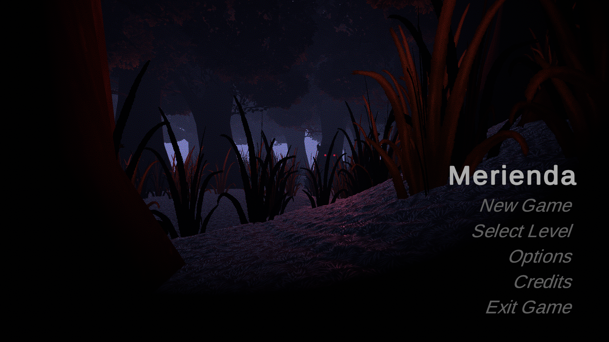
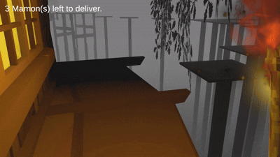

# Merienda 🎮 (A 3D Platformer Game)

## 📝 Overview
A 3D platformer game following the story of a delivery rider exploring a village above the trees at night while a mythical creature roams freely below. It consists of 2 levels with differing difficulties, as well as a simple chase scenario if the player fails to cross the platforms above safely. This project was completed using common practices in game production teams.

## 🚀 Gameplay Features
- Map exploration
- Simple delivery system
- Enemy AI player detection
- Varying difficulties in platforms
- Full gameplay with audio

## 🎥 Game Previews

### Main Menu

### Tutorial

### Gameplay

## ▶ How to Run

1. Download the `.zip` file from the **Releases** section.  
2. Extract the folder.  
3. Run `Merienda.exe`.  
4. If Windows flags it as unknown, select **Run anyway**.

## 📦 Credits

Assets used are from free resources (Itch.io, Freesound.org, Unity Assets Store and various public asset sources).  
Full author list included in:  
📄 *[Credits File](media/credits.txt)*

This project is for learning and non-commercial use.

## 👤 Contribution

All scripting, scene setup, algorithm implementation, character and enemy animation implementation, gameplay implementation, UI logic, bug fixing, and system integration were done by the group.
